# The Client-Server Application Using TCP

# 1 网络基础

## 1.1 **通信协议**

通信协议（Communications Protocol，也称传输协议）在电信中是指在任何物理介质中允许两个或多个在传输系统中的终端之间传播信息的系统标准，也是指计算机通信或网络设备的共同语言。通信协议定义了通信中的语法学, 语义学和同步规则以及可能存在的错误检测与纠正。通信协议在硬件，软件或两者之间皆可实现。

## 1.2 常见的网络传输协议

| 协议                                                         | 所属层（TCP/IP模型） | 描述                                                         |
| :----------------------------------------------------------- | :------------------- | ------------------------------------------------------------ |
| **HTTP**超文本传输协议（Hyper Text Transfer Protocol）      | 应用层               | 是互联网上应用最为广泛的一种网络协议，基于C/S架构进行通信。  |
| **FTP**文件传输协议（File Transfer Protocol）               | 应用层               | 使用 TCP 传输而不是 UDP， 客户在和服务器建立连接前要经过“三次握手”，面向连接， 为数据传输提供可靠保证。 |
| **UDP**用户数据报协议（User Datagram Protocol）             | 传输层               | 无连接的传输层协议，提供面向事务的简单不可靠信息传送服务，在数据传输过程中延迟小、数据传输效率高。 |
| **TCP** 传输控制协议（Transmission Control Protocol）        | 传输层               | 是一种面向连接的、可靠的、基于字节流的传输层通信协议。       |
| **IP**因特网互联协议（Internet Protocol）                   | 网络层               | 主要包含三方面内容：IP编址方案、分组封装格式及分组转发规则。 |
| **ICMP** Internet控制报文协议（Internet Control Message Protocol） | 网络层               | 是TCP/IP协议簇的一个子协议、面向无连接的协议，用于在IP主机、路由器之间传递控制消息（网络通不通、主机是否可达、路由是否可用等网络本身的消息）。 |
| **IGMP** Internet 组管理协议（Internet Group Management Protocol） | 网络层               | 因特网协议家族中的一个组播协议。该协议运行在主机和组播路由器之间。IGMP协议共有三个版本，即IGMPv1、v2 和v3。 |
| **ARP** 正向地址解析协议（Address Resolution Protocol）      | 网络接口层           | 根据IP地址获取物理地址的一个TCP/IP协议。                     |
| **RARP** 反向地址转换协议                                    | 网络接口层           | 通过MAC地址确定IP地址。                                      |

## 1.3 分层模型

### 1.3.1 OSI 七层模型

| 层次   | 名称及描述                                                   |
| ------ | ------------------------------------------------------------ |
| 第七层 | **应用层（Application Layer）**：提供为应用软件而设的接口，以设置与另一应用软件之间的通信。例如: HTTP、HTTPS、FTP、TELNET、SSH、SMTP、POP3、HTML等。 |
| 第六层 | **表达层（Presentation Layer）**：把数据转换为能与接收者的系统格式兼容并适合传输的格式。 |
| 第五层 | **会话层（Session Layer）**：负责在数据传输中设置和维护电脑网络中两台电脑之间的通信连接。 |
| 第四层 | **传输层（Transport Layer）**：把传输表头（TH）加至数据以形成数据包。传输表头包含了所使用的协议等发送信息。例如:传输控制协议（TCP）等。 |
| 第三层 | **网络层（Network Layer）**：决定数据的路径选择和转寄，将网络表头（NH）加至数据包，以形成报文。网络表头包含了网络数据。例如:互联网协议（IP）等。 |
| 第二层 | **数据链路层（Data Link Layer）**：负责网络寻址、错误侦测和改错。例如以太网、无线局域网（Wi-Fi）和通用分组无线服务（GPRS）等。 |
| 第一层 | **物理层（Physical Layer）**：在局部局域网上传送数据帧（Data Frame），它负责管理电脑通信设备和网络媒体之间的互通。包括了针脚、电压、线缆规范、集线器、中继器、网卡、主机接口卡等。 |

### 1.3.2 TCP/IP 四层模型

| 层次   | 名称                                                       |
| ------ | ---------------------------------------------------------- |
| 第四层 | 应用层（application layer）                                |
| 第三层 | 传输层（transport layer）                                  |
| 第二层 | 网络互联层（网络层）（internet layer）                     |
| 第一层 | 网络访问（链接）层（链接层）（Network Access(link) layer） |

### 1.3.3 两种模型对比

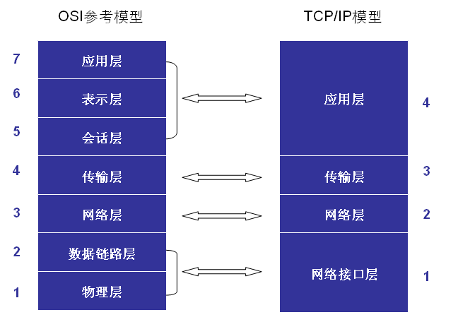

## 1.4 网络应用程序设计模式

|      | C/S (Client-Server Model)                          | B/S (Browser-Server Model)                                   |
| ---- | -------------------------------------------------- | ------------------------------------------------------------ |
| 描述 | 需要在通讯两端各自部署客户机和服务器来完成数据通信 | 只需在一端部署服务器，而另外一端使用每台PC都默认配置的浏览器即可完成数据的传输 |
| 优点 | 可缓存、协议选择灵活                               | 开发周期短、成本低、安全性高、移植性高、不受平台限制         |
| 缺点 | 开发周期长、成本高、安全性低、移植性差、受平台限制 | 不可缓存、协议选择受限                                       |

## 1.5 通信过程

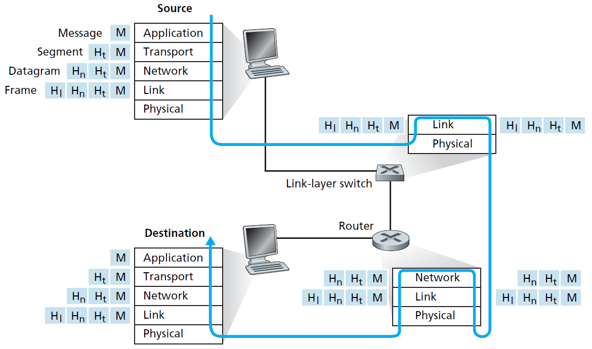

## 1.6 协议格式

### 1.6.1 数据包封装

应用层数据通过协议栈发到网络上时，每层协议都要加上一个数据首部（header），称为封装（Encapsulation）。

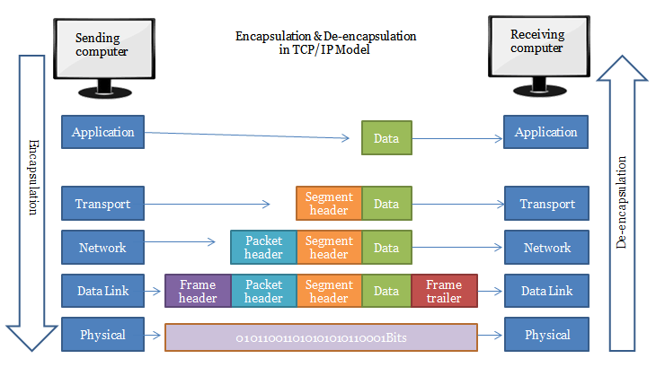

不同的协议层对数据包有不同的称谓，在传输层叫做段（segment），在网络层叫做数据报（datagram），在链路层叫做帧（frame）。数据封装成帧后发到传输介质上，到达目的主机后每层协议再剥掉相应的首部，最后将应用层数据交给应用程序处理。

### 1.6.2 UDP数据报格式

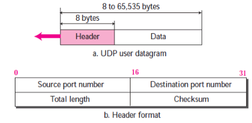

### 1.6.3 TCP数据报格式

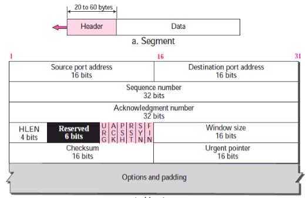


# 2 Socket 编程

## 2.1 Socket 概念

Socket本身有“插座”的意思，在Linux环境下，用于表示进程间网络通信的特殊文件类型。本质为内核借助缓冲区形成的伪文件。与管道类似的，Linux系统将其封装成文件的目的是为了统一接口，使得读写套接字和读写文件的操作一致。区别是管道主要应用于本地进程间通信，而套接字多应用于网络进程间数据的传递。

在TCP/IP协议中，“**IP地址+TCP或UDP端口号**”唯一标识网络通讯中的一个进程。“IP地址+端口号”就对应一个socket。欲建立连接的两个进程各自有一个socket来标识，那么这两个socket组成的socket pair就唯一标识一个连接。因此可以用Socket来描述网络连接的一对一关系。

在网络通信中，**套接字一定是成对出现的**，一端的发送缓冲区对应对端的接收缓冲区。

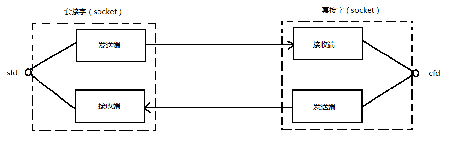

TCP/IP协议最早在BSD UNIX上实现，为TCP/IP协议设计的应用层编程接口称为**socket API**。

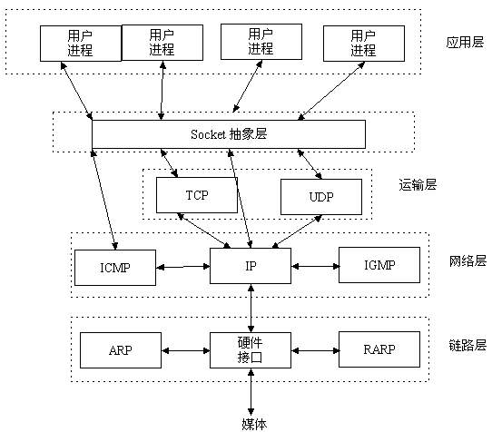

## 2.2 网络字节序

大端序（Big Endian）：高位字节存放到低位地址（高位字节在前）。

小端序（Little Endian）：高位字节存放到高位地址（低位字节在前）。

例如，存放int型数据0x12345678：

| 地址   | 0x00 | 0x01 | 0x02 | 0x03 |
| ------ | ---- | ---- | ---- | ---- |
| 大端序 | 0x12 | 0x34 | 0x56 | 0x78 |
| 小端序 | 0x78 | 0x56 | 0x34 | 0x12 |

网络字节顺序是TCP/IP中规定好的一种数据表示格式，它与具体的CPU类型、操作系统等无关，从而可以保证数据在不同主机之间传输时能够被正确解释。**TCP/IP协议规定，网络数据流应采用大端字节序。**

为使网络程序具有可移植性，使同样的C代码在大端和小端计算机上编译后都能正常运行，可以调用以下库函数做**网络字节序和主机字节序的转换**：

```c
#include <arpa/inet.h>

// h = host, n = network, l = 32-bit long int, s = 16-bit short int
uint32_t htonl(uint32_t hostlong);		// host -> network,	long  int
uint16_t htons(uint16_t hostshort);		// host -> network,	short int
uint32_t ntohl(uint32_t netlong);		// network -> host,	long  int
uint16_t ntohs(uint16_t netshort);		// network -> host,	short int
```

如果主机是小端字节序，这些函数将参数做相应的大小端转换然后返回，如果主机是大端字节序，这些函数不做转换，将参数原封不动地返回。

## 2.3 IP 地址转换函数

IP地址转换函数用于完成IP地址的点分十进制与二进制的相互转化：

```c
#include <arpa/inet.h>

/* This function converts the character string src into a network address structure in the af address family, then copies the network address structure to dst.  The af argument must be either AF_INET or AF_INET6. */
int inet_pton(int af, const char *src, void *dst);

/* This function converts the network address structure src in the af address family into a character string. The resulting string is copied to the buffer pointed to by dst, which must be a non-null pointer. The caller specifies the number of bytes available in this buffer in the argument size. */
const char *inet_ntop(int af, const void *src, char *dst, socklen_t size);

```

## 2.4 sockaddr _in  _in6 _un 数据结构

用于存储参与（IP）Windows/linux套接字通信的计算机上的一个internet协议（IP）地址。为了统一地址结构的表示方法 ，统一接口函数，使得不同的地址结构可以被bind()、connect()、recvfrom()、sendto()等函数调用。但一般的编程中并不直接对此数据结构进行操作，而使用另一个与之等价的数据结构sockaddr_in。这是由于Microsoft TCP/IP套接字开发人员的工具箱仅支持internet地址字段，而实际填充字段的每一部分则遵循sockaddr_in数据结构，两者大小都是16字节，所以二者之间可以进行切换。

很多网络编程函数诞生早于IPv4协议，那时候都使用的是sockaddr结构体,为了向前兼容，现在sockaddr退化成了（void *）的作用，传递一个地址给函数，至于这个函数是sockaddr_in还是sockaddr_in6，由地址族确定，然后函数内部再强制类型转化为所需的地址类型。

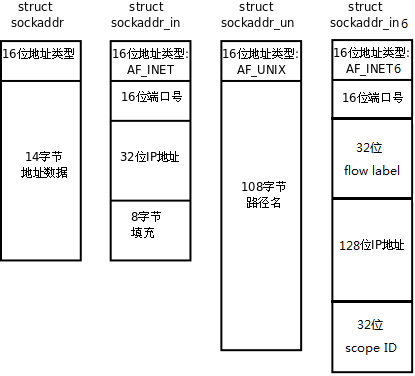

sockaddr定义为：

```c
struct sockaddr {
	sa_family_t sa_family; 		/* address family, AF_xxx */
	char sa_data[14];			/* 14 bytes of protocol address */
};
```

sockaddr_in定义为：

```c
struct sockaddr_in {
	__kernel_sa_family_t sin_family; 	/* Address family */  	
	__be16 sin_port;					/* Port number */	
	struct in_addr sin_addr;			/* Internet address */	
	/* Pad to size of `struct sockaddr'. */
	unsigned char __pad[__SOCK_SIZE__ - sizeof(short int) - 
    sizeof(unsigned short int) - sizeof(struct in_addr)];
};

struct in_addr {						/* Internet address. */
	__be32 s_addr;
};
```

sockaddr_in6定义为：

```c
struct sockaddr_in6 {
	unsigned short int sin6_family; 	/* AF_INET6 */
	__be16 sin6_port; 					/* Transport layer port # */
	__be32 sin6_flowinfo; 				/* IPv6 flow information */
	struct in6_addr sin6_addr;			/* IPv6 address */
	__u32 sin6_scope_id; 				/* scope id (new in RFC2553) */
};

struct in6_addr {
	union {
		__u8 u6_addr8[16];
		__be16 u6_addr16[8];
		__be32 u6_addr32[4];
	} in6_u;
	#define s6_addr 		in6_u.u6_addr8
	#define s6_addr16 		in6_u.u6_addr16
	#define s6_addr32	 	in6_u.u6_addr32
};
```

sockaddr_un定义为：

```c
#define UNIX_PATH_MAX 108
struct sockaddr_un {
	__kernel_sa_family_t sun_family; 	/* AF_UNIX */
	char sun_path[UNIX_PATH_MAX]; 		/* pathname */
};
```

IPv4和IPv6的地址格式定义在netinet/in.h中。

IPv4地址用sockaddr_in结构体表示，包括16位端口号和32位IP地址。

IPv6地址用sockaddr_in6结构体表示，包括16位端口号、128位IP地址和一些控制字段。

UNIX Domain Socket的地址格式定义在sys/un.h中，用sock-addr_un结构体表示。

各种socket地址结构体的开头都是相同的，前16位表示整个结构体的长度（并不是所有UNIX的实现都有长度字段，如Linux就没有），后16位表示地址类型。IPv4、IPv6和Unix Domain Socket的地址类型分别定义为常数AF_INET、AF_INET6、AF_UNIX。这样，只要取得某种sockaddr结构体的首地址，不需要知道具体是哪种类型的sockaddr结构体，就可以根据地址类型字段确定结构体中的内容。

因此，**socket API可以接受各种类型的sockaddr结构体指针做参数**，例如bind、accept、connect等函数，这些函数的参数应该设计成**void *类型**以便接受各种类型的指针。

但是sock API的实现早于ANSI C标准化，那时还没有void *类型，因此这些函数的参数都用**struct sockaddr *类型**表示，在传递参数之前要进行**强制类型转换**，例如：

```c
struct sockaddr_in servaddr;
bind(listen_fd, (struct sockaddr *)&servaddr, sizeof(servaddr));		
```

## 2.5 网络套接字函数

### 2.5.1 socket模型创建流程图


### 2.5.2 socket 函数

socket()打开一个网络通讯端口，如果成功的话，就像open()一样返回一个文件描述符，应用程序可以像读写文件一样用read/write在网络上收发数据，如果socket()调用出错则返回-1。对于IPv4，domain参数指定为AF_INET。对于TCP协议，type参数指定为SOCK_STREAM，表示面向流的传输协议。如果是UDP协议，则type参数指定为SOCK_DGRAM，表示面向数据报的传输协议。protocol参数的介绍从略，指定为0即可。

```C
#include <sys/types.h>
#include <sys/socket.h>
int socket(int domain, int type, int protocol);
domain:
	AF_INET 这是大多数用来产生socket的协议，使用TCP或UDP来传输，用IPv4的地址
	AF_INET6 与上面类似，不过是来用IPv6的地址
	AF_UNIX 本地协议，使用在Unix和Linux系统上，一般都是当客户端和服务器在同一台及其上的时候使用
type:
	SOCK_STREAM 这个协议是按照顺序的、可靠的、数据完整的基于字节流的连接。这是一个使用最多的socket类型，这个socket是使用TCP来进行传输。
	SOCK_DGRAM 这个协议是无连接的、固定长度的传输调用。该协议是不可靠的，使用UDP来进行它的连接。
	SOCK_SEQPACKET该协议是双线路的、可靠的连接，发送固定长度的数据包进行传输。必须把这个包完整的接受才能进行读取。
	SOCK_RAW socket类型提供单一的网络访问，这个socket类型使用ICMP公共协议。（ping、traceroute使用该协议）
	SOCK_RDM 这个类型是很少使用的，在大部分的操作系统上没有实现，它是提供给数据链路层使用，不保证数据包的顺序
protocol:
	传0 表示使用默认协议。
返回值：
	成功：返回指向新创建的socket的文件描述符，失败：返回-1，设置errno
```

### 2.5.3 bind 函数

服务器程序所监听的网络地址和端口号通常是固定不变的，客户端程序得知服务器程序的地址和端口号后就可以向服务器发起连接，因此服务器需要调用bind绑定一个固定的网络地址和端口号。

```c
#include <sys/types.h> 
#include <sys/socket.h>
int bind(int sockfd, const struct sockaddr *addr, socklen_t addrlen);
sockfd：
	socket文件描述符
addr:
	构造出IP地址加端口号
addrlen:
	sizeof(addr)长度
返回值：
	成功返回0，失败返回-1, 设置errno
```

bind()的作用是将参数sockfd和addr绑定在一起，使sockfd这个用于网络通讯的文件描述符监听addr所描述的地址和端口号。前面讲过，struct sockaddr *是一个通用指针类型，addr参数实际上可以接受多种协议的sockaddr结构体，而它们的长度各不相同，所以需要第三个参数addrlen指定结构体的长度。如：

```c
struct sockaddr_in servaddr;
bzero(&servaddr, sizeof(servaddr));
servaddr.sin_family = AF_INET;
servaddr.sin_addr.s_addr = htonl(INADDR_ANY);
servaddr.sin_port = htons(5000);
```

首先将整个结构体清零，然后设置地址类型为AF_INET，网络地址为INADDR_ANY，这个宏表示本地的任意IP地址，因为服务器可能有多个网卡，每个网卡也可能绑定多个IP地址，这样设置可以在所有的IP地址上监听，直到与某个客户端建立了连接时才确定下来到底用哪个IP地址，端口号为5000。

### 2.5.4 listen 函数

```c
#include <sys/types.h>
#include <sys/socket.h>
int listen(int sockfd, int backlog);
sockfd:
	socket文件描述符
backlog:
	排队建立3次握手队列和刚刚建立3次握手队列的链接数和
```

典型的服务器程序可以同时服务于多个客户端，当有客户端发起连接时，服务器调用的accept()返回并接受这个连接，如果有大量的客户端发起连接而服务器来不及处理，尚未accept的客户端就处于连接等待状态，listen()声明sockfd处于监听状态，并且最多允许有**backlog**个客户端处于连接待状态，如果接收到更多的连接请求就忽略。listen()成功返回0，失败返回-1。

linux下查看系统默认backlog的指令是：

```shell
$ cat /proc/sys/net/ipv4/tcp_max_syn_backlog
```

### 2.5.5 accept 函数

```c
#include <sys/types.h> 		
#include <sys/socket.h>
int accept(int sockfd, struct sockaddr *addr, socklen_t *addrlen);
sockdf:
	socket文件描述符
addr:
	传出参数，返回链接客户端地址信息，含IP地址和端口号
addrlen:
	传入传出参数（值-结果）,传入sizeof(addr)大小，函数返回时返回真正接收到地址结构体的大小
返回值：
	成功返回一个新的socket文件描述符，用于和客户端通信，失败返回-1，设置errno
```

三次握手完成后，服务器调用accept()接受连接，如果服务器调用accept()时还没有客户端的连接请求，就阻塞等待直到有客户端连接上来。addr是一个传出参数，accept()返回时传出客户端的地址和端口号。addrlen参数是一个传入传出参数（value-result argument），传入的是调用者提供的缓冲区addr的长度以避免缓冲区溢出问题，传出的是客户端地址结构体的实际长度（有可能没有占满调用者提供的缓冲区）。如果给addr参数传NULL，表示不关心客户端的地址。

### 2.5.6 connect 函数

```c
#include <sys/types.h> 					
#include <sys/socket.h>
int connect(int sockfd, const struct sockaddr *addr, socklen_t addrlen);
sockdf:
	socket文件描述符
addr:
	传入参数，指定服务器端地址信息，含IP地址和端口号
addrlen:
	传入参数,传入sizeof(addr)大小
返回值：
	成功返回0，失败返回-1，设置errno
```

客户端需要调用connect()连接服务器，connect和bind的参数形式一致，区别在于bind的参数是自己的地址，而connect的参数是对方的地址。connect()成功返回0，出错返回-1。


# 3 实践：TCP 实现 C/S 模型

## 3.1 TCP 协议 C/S 通信一般流程：

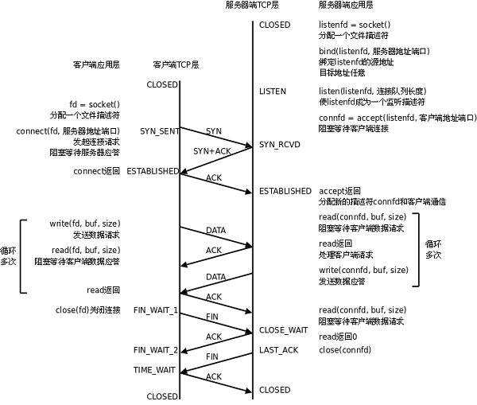

服务器调用socket()、bind()、listen()完成初始化后，调用accept()阻塞等待，处于监听端口的状态，客户端调用socket()初始化后，调用connect()发出SYN段并阻塞等待服务器应答，服务器应答一个SYN-ACK段，客户端收到后从connect()返回，同时应答一个ACK段，服务器收到后从accept()返回。

## 3.2 通信过程

建立连接后，TCP协议提供全双工的通信服务，但是一般的客户端/服务器程序的流程是由客户端主动发起请求，服务器被动处理请求，一问一答的方式。因此，服务器从accept()返回后立刻调用read()，读socket就像读管道一样，如果没有数据到达就阻塞等待，这时客户端调用write()发送请求给服务器，服务器收到后从read()返回，对客户端的请求进行处理，在此期间客户端调用read()阻塞等待服务器的应答，服务器调用write()将处理结果发回给客户端，再次调用read()阻塞等待下一条请求，客户端收到后从read()返回，发送下一条请求，如此循环下去。

如果客户端没有更多的请求了，就调用close()关闭连接，就像写端关闭的管道一样，服务器的read()返回0，这样服务器就知道客户端关闭了连接，也调用close()关闭连接。注意，任何一方调用close()后，连接的两个传输方向都关闭，不能再发送数据了。如果一方调用shutdown()则连接处于半关闭状态，仍可接收对方发来的数据。

## 3.3 Server

server.c的作用是从客户端读字符，然后将每个字符转换为大写并回送给客户端。

```c
#include <stdio.h>
#include <unistd.h>
#include <sys/types.h>
#include <sys/socket.h>
#include <strings.h>
#include <string.h>
#include <ctype.h>
#include <arpa/inet.h>

#define SERV_PORT 9527

int main(void)
{
    int sfd, cfd;
    int len, i;
    char buf[BUFSIZ], clie_IP[BUFSIZ];

    struct sockaddr_in serv_addr, clie_addr;
    socklen_t clie_addr_len;

    /* 创建一个socket 指定IPv4协议族 TCP协议 */
    sfd = socket(AF_INET, SOCK_STREAM, 0);

    /* 初始化一个地址结构 */
    bzero(&serv_addr, sizeof(serv_addr));           // 将整个结构体清零
    serv_addr.sin_family = AF_INET;                 // 选择协议族为IPv4
    serv_addr.sin_addr.s_addr = htonl(INADDR_ANY);  // 监听本地所有IP地址
    serv_addr.sin_port = htons(SERV_PORT);          // 绑定端口号    

    /* 绑定服务器地址结构 */
    bind(sfd, (struct sockaddr *)&serv_addr, sizeof(serv_addr));

    /* 设定链接上限（同一时刻允许向服务器发起链接请求的数量），注意此处不阻塞 */
    listen(sfd, 64);                  

    printf("wait for client connect ...\n");

    /* 获取客户端地址结构大小 */ 
    clie_addr_len = sizeof(clie_addr_len);
    /* 监听客户端链接, 会阻塞 */
    cfd = accept(sfd, (struct sockaddr *)&clie_addr, &clie_addr_len);           

    printf("client IP:%s\tport:%d\n", 
            inet_ntop(AF_INET, &clie_addr.sin_addr.s_addr, clie_IP, sizeof(clie_IP)), 
            ntohs(clie_addr.sin_port));

    while (1) {
        /* 读取客户端发送数据 */
        len = read(cfd, buf, sizeof(buf));
        write(STDOUT_FILENO, buf, len);

        /* 处理客户端数据 */
        for (i = 0; i < len; i++)
            buf[i] = toupper(buf[i]);

        /* 处理完数据回写给客户端 */
        write(cfd, buf, len); 
    }

    /* 关闭链接 */
    close(sfd);
    close(cfd);

    return 0;
}

```

## 3.4 Client

client.c的作用是给服务端发字符，然后接受从服务端返回的转化为大写后的字符。

```c
#include <stdio.h>
#include <unistd.h>
#include <string.h>
#include <sys/socket.h>
#include <arpa/inet.h>

#define SERV_IP "127.0.0.1"
#define SERV_PORT 9527

int main(void)
{
    int sfd, len;
    struct sockaddr_in serv_addr;
    char buf[BUFSIZ]; 

    /* 创建一个socket 指定IPv4 TCP */
    sfd = socket(AF_INET, SOCK_STREAM, 0);

    /* 初始化一个地址结构 */
    bzero(&serv_addr, sizeof(serv_addr));  
    serv_addr.sin_family = AF_INET;    
    inet_pton(AF_INET, SERV_IP, &serv_addr.sin_addr.s_addr);  
    serv_addr.sin_port = htons(SERV_PORT);

    /* 根据地址结构链接指定服务器进程 */
    connect(sfd, (struct sockaddr *)&serv_addr, sizeof(serv_addr));

    while (1) {
        /* 从标准输入获取数据 */
        fgets(buf, sizeof(buf), stdin);
        /* 将数据写给服务器 */
        write(sfd, buf, strlen(buf));  
        /* 从服务器读回转换后数据 */
        len = read(sfd, buf, sizeof(buf));
        /* 写至标准输出 */
        write(STDOUT_FILENO, buf, len);
    }

    /* 关闭链接 */
    close(sfd);

    return 0;
}

```

## 3.5 ubuntu16.04环境实施过程

1. 建立文件夹tcpServer，里面存放server.c和client.c

2. 在终端打开该文件夹，输入如下指令进行编译，生成.exe文件：

   ```shell
   $ gcc server.c -o server.exe
   $ gcc client.c -o client.exe
   ```

3. 输入如下指令开启服务端：

   ```shell
   $ ./server.exe
   ```

   得到如下结果：

   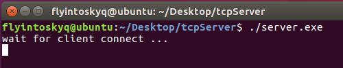

4. 再输入如下指令开启客户端：

   ```shell
   $ ./client.exe
   ```

   得到如下结果：

   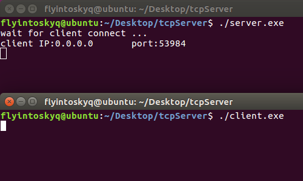

5. 可见c-s连接成功，这时在client输入hello world，即可接受到服务端返回的转成大写后的HELLO WORLD

   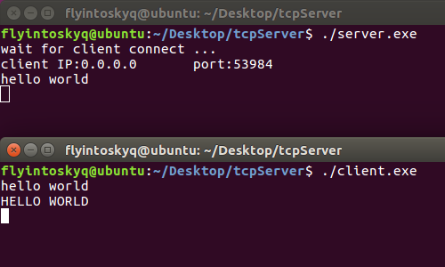

## 3.6 Win10环境实施过程

1. 建立文件夹tcpServer，里面存放server.c和client.c

2. 在CMD打开该文件夹，输入如下指令进行编译，生成.exe文件：

   ```shell
   > gcc server.c -o server.exe
   > gcc client.c -o client.exe
   ```

3. 在CMD输入如下两条指令中任意一条开启服务端：

   ```shell
   > server.exe
   > server
   ```

   或者在PowerShell输入如下两条指令中任意一条开启服务端：

   ```powershell
   > ./server.exe
   > ./server
   ```

4. 再在CMD输入如下两条指令中任意一条开启客户端：

   ```shell
   > client.exe
   > client
   ```

   或者在PowerShell输入如下两条指令中任意一条开启客户端：

   ```powershell
   > ./client.exe
   > ./client
   ```

5. 可见c-s连接成功，这时在client输入hello world，即可接受到服务端返回的转成大写后的HELLO WORLD

   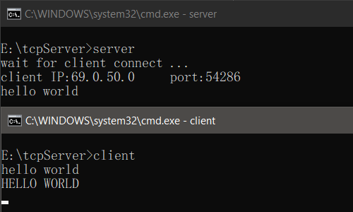

## 3.7 NC 代替Client

在server启动后，可以使用nc指令充当客户端直接链接服务器，指令格式为：

```text
nc ip port
```

例如在ubunt16.04或win10环境（CMD/PowerShell）分别使用如下指令均可：

```shell
$ nc 127.0.0.1 9527
> nc 127.0.0.1 9527
```

均可得到相同结果：

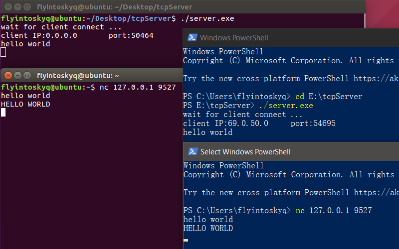

## 3.8 解决'nc'错误

在win使用nc如果遇到如下报错：

```text
'nc' is not recognized as an internal or external command
```

则说明未安装nc，可以通过如下步骤解决：

1. 访问网址https://eternallybored.org/misc/netcat/，下载netcat文件
2. 将下载的netcat文件夹中的所有内容拷贝至C:\Windows\System32文件夹下
3. 将netcat文件路径添加至系统环境变量PATH中即可。

